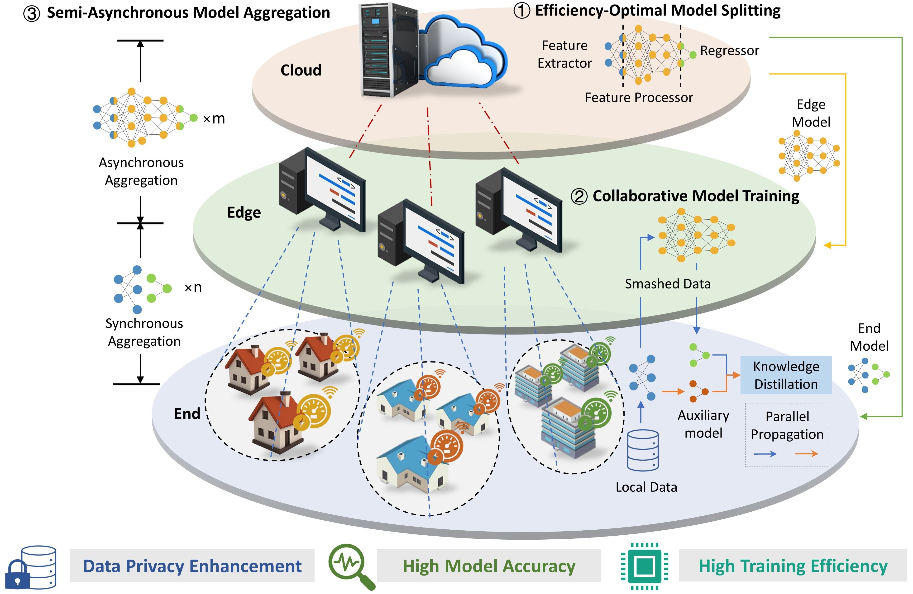
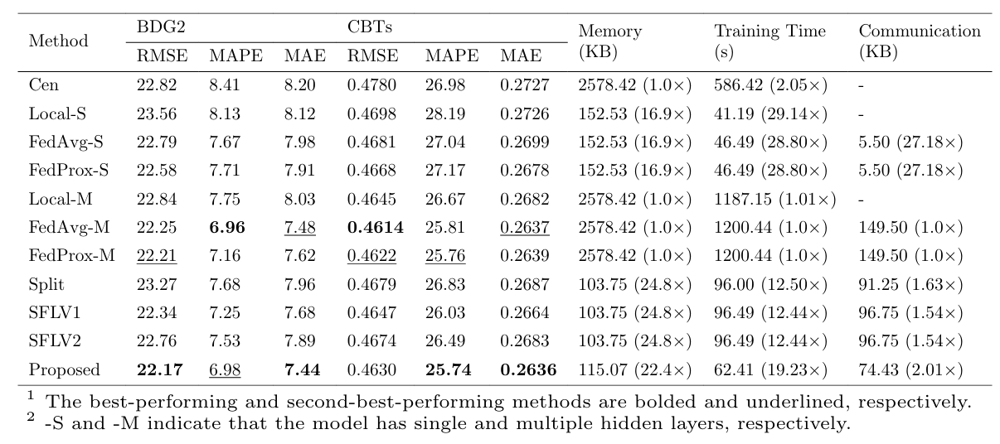

# Introducing Edge Intelligence to Smart Meters via Federated Split Learning

This is the codebase for our paper "Introducing Edge Intelligence to Smart Meters via Federated Split Learning".

## Overview

Low-cost smart meters are ubiquitous in smart grids. Enabling resource-constraint smart meters to perform deep learning is quite challenging. Our end-edge-cloud framework reveals a new path for edge intelligence on smart meters. It improves 95.6% memory footprint, 94.8% training time, and 50% communication overhead, achieving comparable or even superior forecasting accuracy to the
resource-unlimited methods. We provide code for established experimental and simulation platforms.

## Dataset

The current version supports the following datasets and tasks are saved in `dataset`:
- BDG2 - Building load forecasting
- CBTs - Residential load forecasting

## Experimental platform

You can build the **experimental platform** with three components: microcontrollers, personal computers and tower server. `experimental_platform` is loaded with the code deployed on them.
> **Note:** The microcontrollers are coded in  **C language** and the computers and tower server are coded in **Python**.
> 

To use the provided code, you are supposed to:
- Compile `experimental_platform/smart_meter/USER/.uvprojx` and download the code to the flash memory of microcontrollers.
- Run `experimental_platform/edge_server/Edge_server` on computers.
- Run `experimental_platform/cloud_server/Cloud_server` on server.
> **Note:** Please ensure the communication network is connected and stable before use.
 
## Simulation platform

You can also build the **simulation platform** with the tower server. `simulation_platform` is loaded with the code deployed on it.

To use the provided code, please run `simulation_platform/Test.py` to obtain results.

## Requirement

Experimental platform:
- μVision 5.3+
- STM32F405 MCU

Simulation platform:
- Python 3.6+
- PyTorch 1.4.0+
- Inter-i7-12700-4.9GHz CPU

## Experimental results

Enable resource-constrained smart meters to execute resource-intensive intelligent algorithms!

 - Performance comparison

 - Accuracy versus memory footprint

 - Impacts on energy management 

## Video
 - Smart meters are performing 4-hour-ahead load forecasting. The red line is the truth value and the blue line is the prediction value.

 
